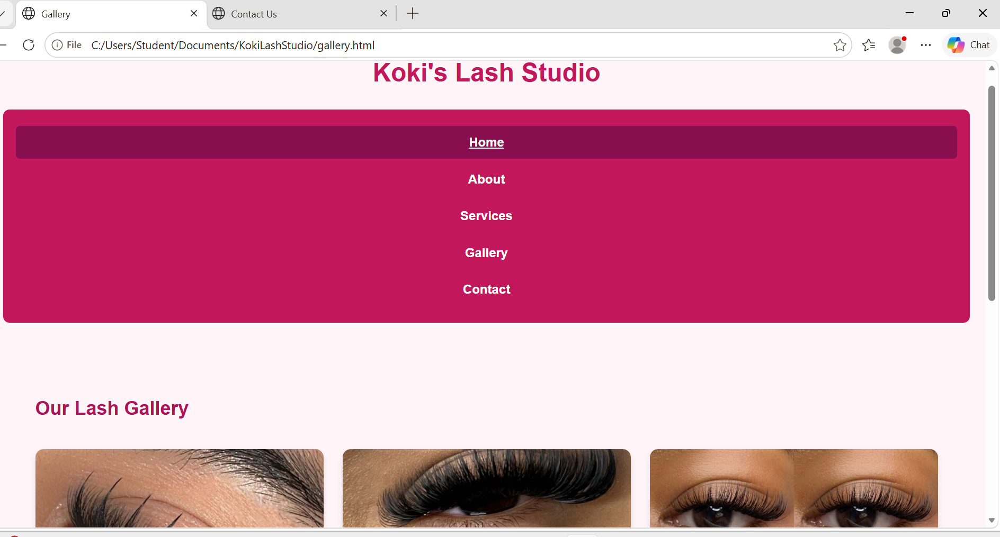
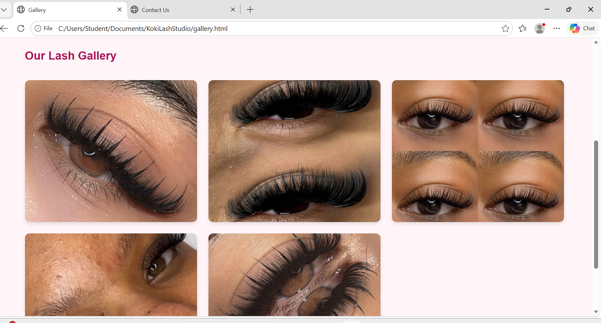
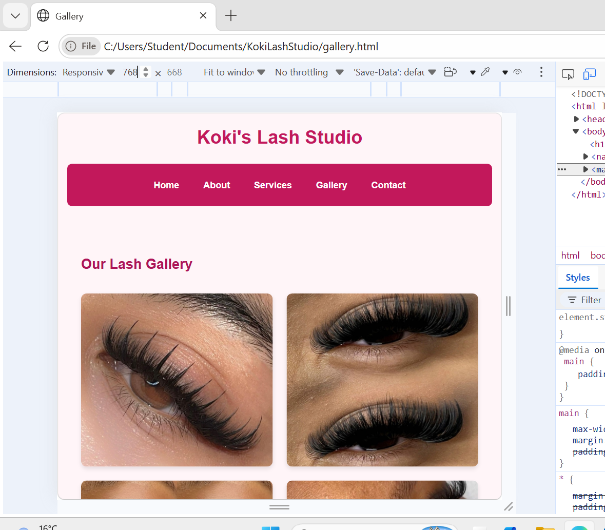
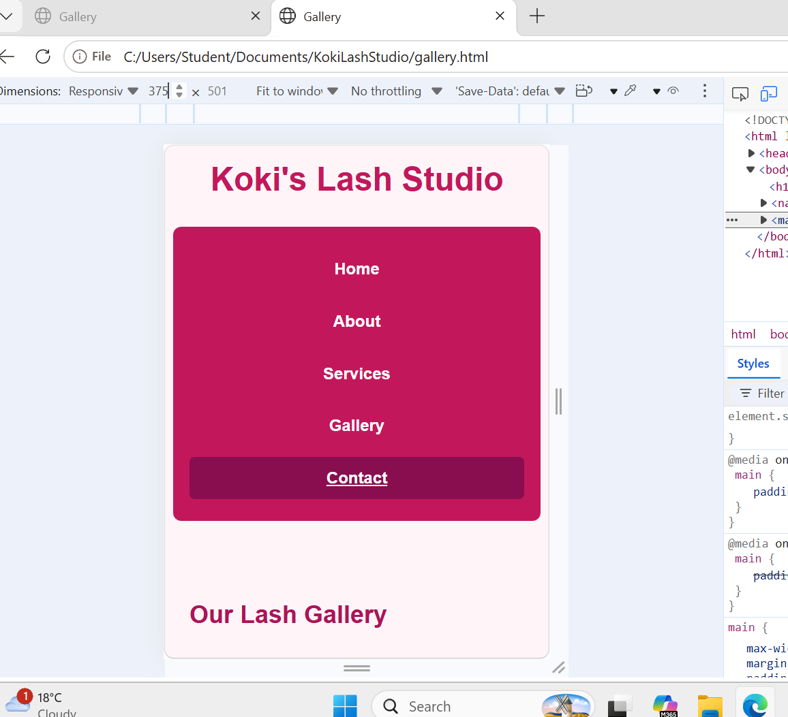
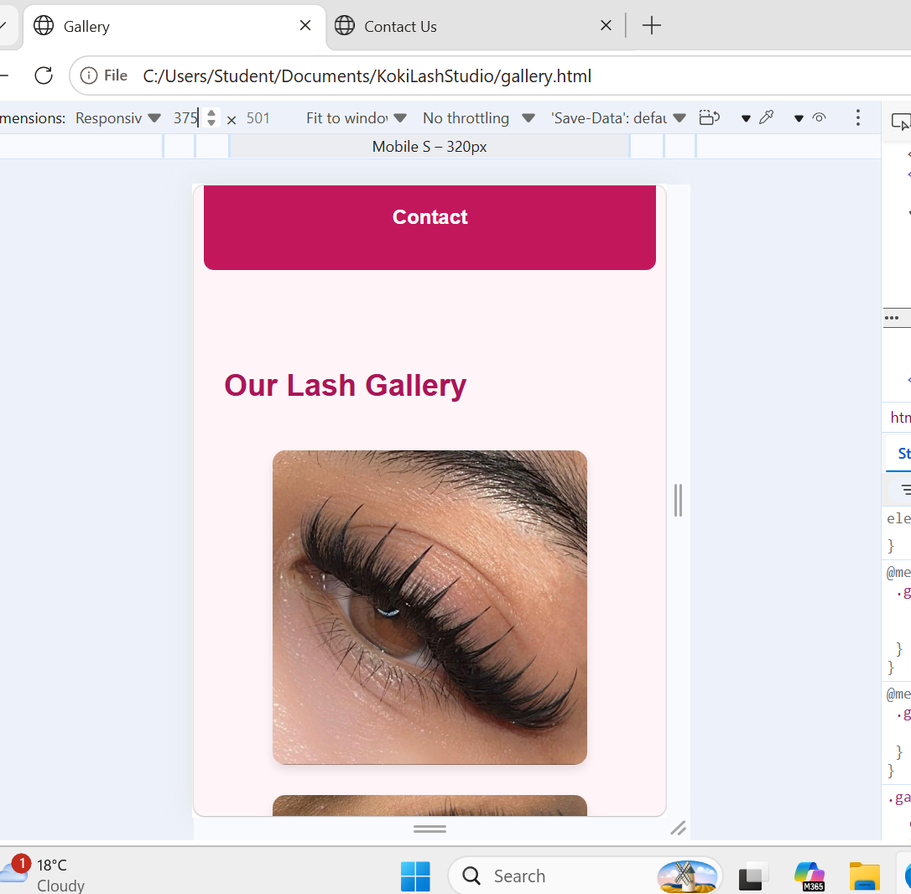

## Changelog

### Part 2 – CSS Styling and Responsive Design

- Created and linked an external `style.css` stylesheet to the website pages.
- Added a consistent pink colour scheme across the website.
- Improved typography, spacing, margins and padding.
- Styled the navigation menu and added interactive hover effects.
- Improved the layout of the Home, About, Services, Gallery and Contact pages.
- Added styled service cards to clearly display lash services and prices.
- Improved the gallery layout and made the lash images consistent in size.
- Styled the contact form, input fields and Send button.
- Added responsive design using CSS media queries.
- Added a tablet breakpoint for screens between 601px and 960px.
- Added a mobile breakpoint for screens 600px and below.
- Changed the gallery from three columns on desktop to two columns on tablet and one column on mobile.
- Changed the navigation to a vertical layout on mobile screens.
- Tested the website using Chrome Developer Tools at different screen sizes.
- Added desktop, tablet and mobile screenshots as evidence of responsive testing.

### Changes Made Based on Part 1 Feedback

- Improved the website structure and organisation based on the feedback received in Part 1.
- Improved the website content and added clearer information about Koki's Lash Studio and its services.
- Improved the visual layout of the website to make the content more organised and user-friendly.
- Improved the gallery layout and presentation of images.
- Improved the Services page by clearly presenting the available lash services, descriptions and prices.
- Improved the Contact page and added a clearly structured contact form.
- Added an external CSS stylesheet to create consistent styling throughout the website.
- Improved typography, spacing, colours and page layouts.
- Added responsive layouts for desktop, tablet and mobile devices.
- Added and improved the README documentation.
- Expanded the changelog to provide a clearer record of website development and changes.
- Added screenshot evidence showing the website at different screen sizes.
- Improved documentation to address the Part 1 feedback requesting more detail and accuracy.

## Responsive Testing Screenshots

The website was tested using Chrome Developer Tools to ensure that it displays correctly on desktop, tablet and mobile screen sizes.

### Desktop

### Tablet – 768px

### Mobile – 375px

## References

- W3Schools. CSS Media Queries. Used as a reference for media queries, breakpoints and responsive web design.
  https://www.w3schools.com/css/css3_mediaqueries.asp

- MDN Web Docs. Responsive Web Design. Used as a reference for responsive layouts, viewport settings and media queries.
  https://developer.mozilla.org/en-US/docs/Learn_web_development/Core/CSS_layout/Responsive_Design

- Dave Gray. CSS Media Queries & Responsive Web Design Tutorial for Beginners. YouTube. Used as additional guidance for responsive web design and testing different screen sizes.
  https://www.youtube.com/watch?v=69IbzTWg5PM

### Image Sources

The lash images used in the website gallery were sourced from Pinterest for educational purposes.

- lashes1.jpg – Pinterest
- lashes2.jpg – Pinterest
- lashes3.jpg – Pinterest
- lashes4.jpg – Pinterest
- lashes5.jpg – Pinterest

Pinterest:
https://www.pinterest.com/